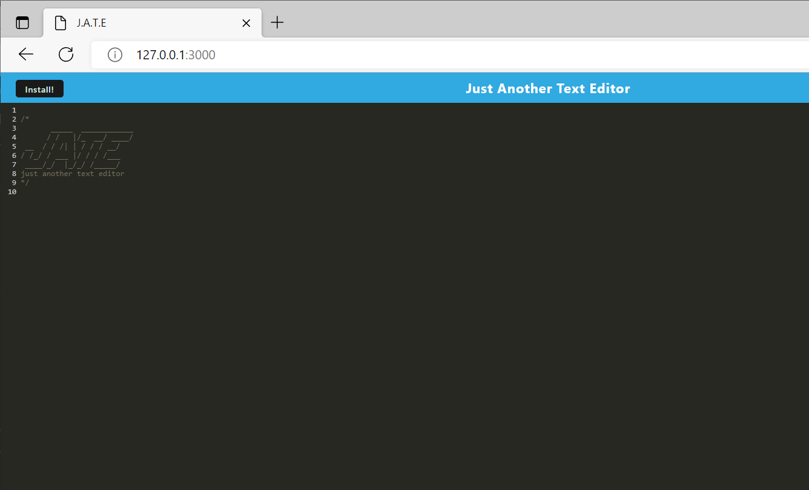
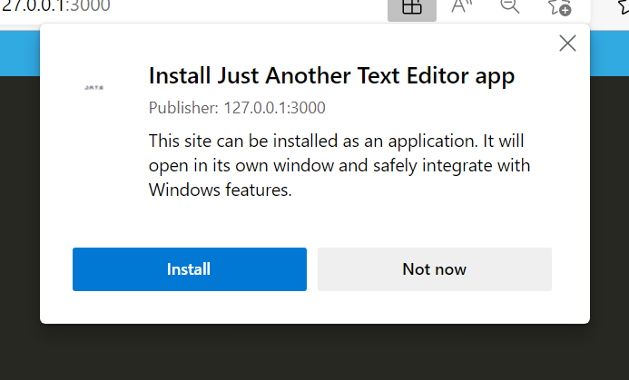
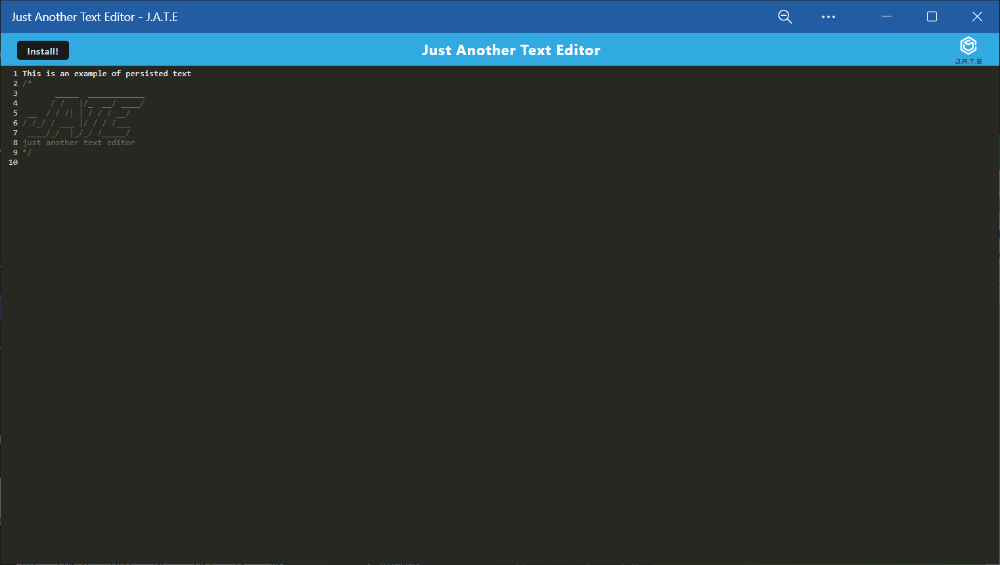

# 19 PWA Challenge: Just Another Text Editor (jate)

## Table of Contents
- [Description](#description)
- [Visuals](#visuals)
- [Usage](#usage)

## Description
This is the solution JavaScript for the 02-Challenge assignment in the 19 PWA Module.

The purpose of the assignment was to add DB, local caching, and PWA installation capabilities to the JATE starter code.

## Usage 
This program is a text editor that can be run in-browser, or be installed to the PC or mobile device with the "install" button at the top-left of the display.

## Installation Instructions
This program has has dependencies, and requires their installation via *npm*.  This project has both a server and a client component, with the client component requiring a build.  This can all be invoked via Node at the command prompt using *npm run start:dev*.

## Visuals
### The program in operation

